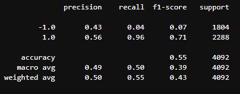
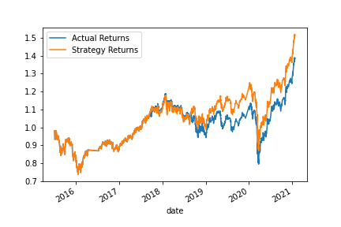
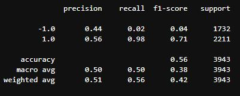
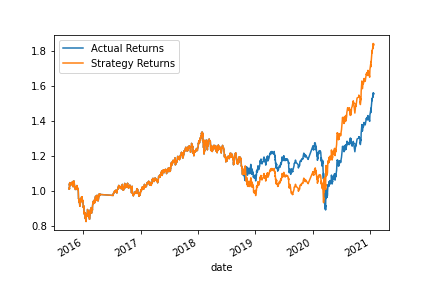
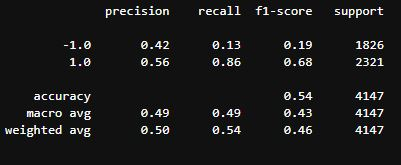
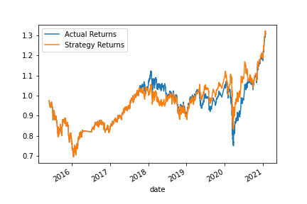
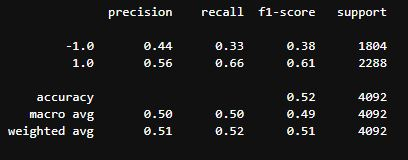

# Assignment---Module-14

## Overview of the Analysis

In this section, describe the analysis you completed for the machine learning models used in this Challenge. This might include:

### Purpose

The purpose of this assignment is to enhance the algorithmic trading system in place with machine learning.

We are trying to predict whether to buy or sell based on signals generated by our algorithm.

### Process

The process is as follows:

* import the data
* filter out the "Close" column and calculate the Actual Returns using pct_change() method

* we generate trading signals by establishing a short window of 4 days, and a long window of 100 days.
* the simple moving average is calculated for each window
* We define the buy signal as greater than 0 (1.0) and the sell signal less than 0 (-1.0).

* In order to split the training and testing set we use the DateOffset() function.
* Unlike the training_test_split that randomly slects training and testing data, here we use sequential data, splitting training and testing data by points in time.

* We standardize the data as we are using a distance method in our machine learning algorithm. We use StandardScaler()

* We use SKLearn's support vector machine (SVM) learning method to fit the data and make predictions

* A new dataframe is created to hold predictions and actual returns.
* This new dataframe is plotted.

### Report

For our original model, using: 
* SVM learning method
* short window of 4
* long window of 100
* training set of 3 months

We see an accuracy of 50 or below, which is not very good, similar to a random prediction.

We see in our recall value only 4% of sell predictions (-1.0) correctly predicted.

Perhaps the SVM is not an appropriate model here.

## Tune the Baseline Trading Algorithm

### What impact resulted from increasing or decreasing the training window?

For the first tuned model, I increased the training set to 6 months:
* SVM learning method
* short window of 4
* long window of 100
* training set of 6 months

Returns from the strategy seems to have improved by increaing the training window from 3 to 6 months. The latter half of 2021 sees greater returns.

Precision remains about the same compared to the original model. So too accuracy, with only a 1% increase. Recall for the sell signal decreased by 2%, and for buy increased by 2%. Overall the reports for each model are very similar.

### What impact resulted from increasing or decreasing either or both of the SMA windows?

For the second tuned model, I decreased the long window to 50 days:
* SVM learning method
* short window of 4
* long window of 50
* training set of 3 months

The cumulative product plot shows a decrease from our original model, where now strategy returns are on par with actual returns.

In the report we see similar precision scores, the same acuracy scores, but an increase in the buy signal recall to 13% coupled with a decrease in sell signal recall to 86%

## New Machine Learning Classifier

For the new model I use Logistic Regression.

In the logistic regression model, accuracy remains about the same as the baseline model at 50%. Recall, however, was improved for both buy and sell signalls - 33% and 66% respectively.

Strategy Returns for the Logistic Regression model were outperforming Actual until the end of 2021 when our strategy starts to move in the opposite direction. 
Therefore, this model seemed to perform worse than the baseline model.

Overall, the model with the best performance, as seen in the cumulative product of the actual returns vs. the strategy , is the first tuned model ( with a training set increased to 6 months).